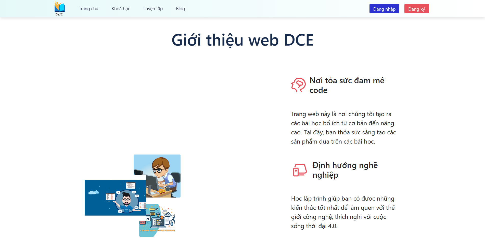

# [REACTJS] DCE - Website for programming courses

## Introduction

Hello everyone, this is the project about programming courses. You can check it out:

    

## Motivation

My team has decided to implement this project because of seeing the lacks of online programing courses. DCE stands for Developing Courses Education. The website is for who wants to learn programming online. We have so many courses on the website with many choices for users.

## Installation

First time you see this repository, you must clone it and then run the following command:

### `npm install`

Moreover, you should have a backend which is running with ExpressJS and NodeJS. If you don't have, you can clone it from another repository in my github, it is `dce2021Be`.
You should also have your database to run successfully.

Next, you will create an .env file in your repository. After all the configuration, you can run the following command:

### `npm start`

And... That's all what you need.

## Requirements

-   **nodejs >=14**

## Thank you

Thank you for the excellent contributions of my team to implement this project. I appreciate you if you have any questions and some comments for us to improve this project.
